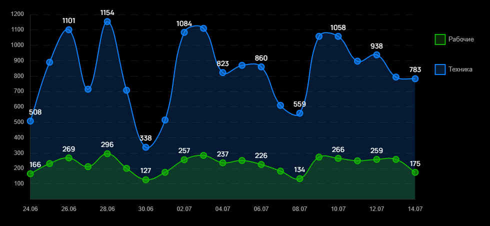

# Задание для прохождения практики

Целью данного проекта была разработка инструмента для построения графиков, в котором дополнительно прорисовывались бы тултипы к точкам, а также при наведении на них курсора скрывались бы соседние тултипы (для удобства при просмотре).

За основу проекта была взята библиотека Chart.js.

## Стек технологий:
- TypeScript
- Vue.js
- Chart.js
- SCSS

## Скриншот проекта

